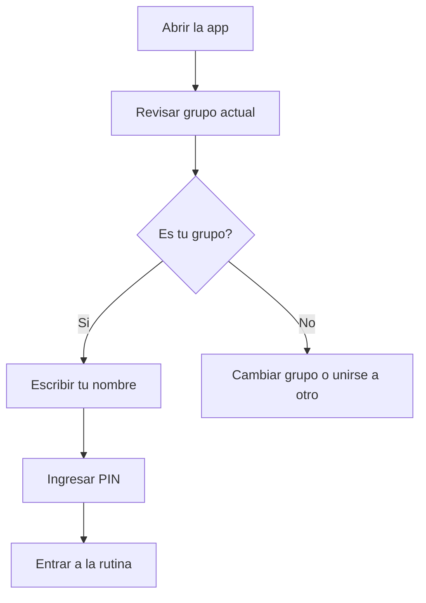
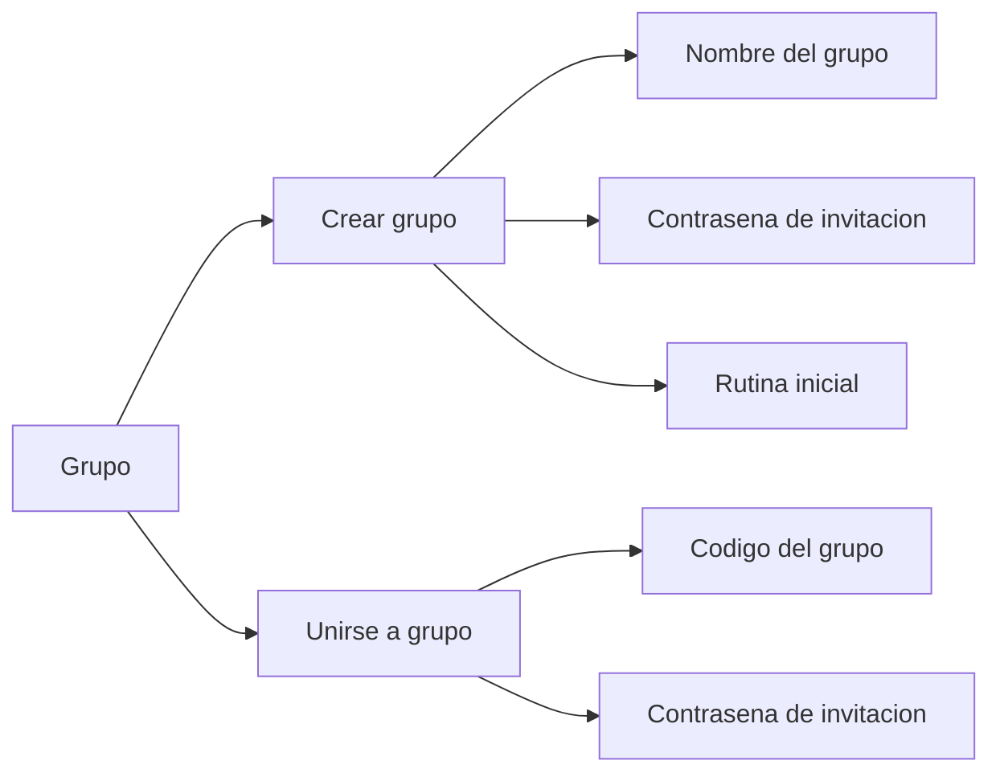
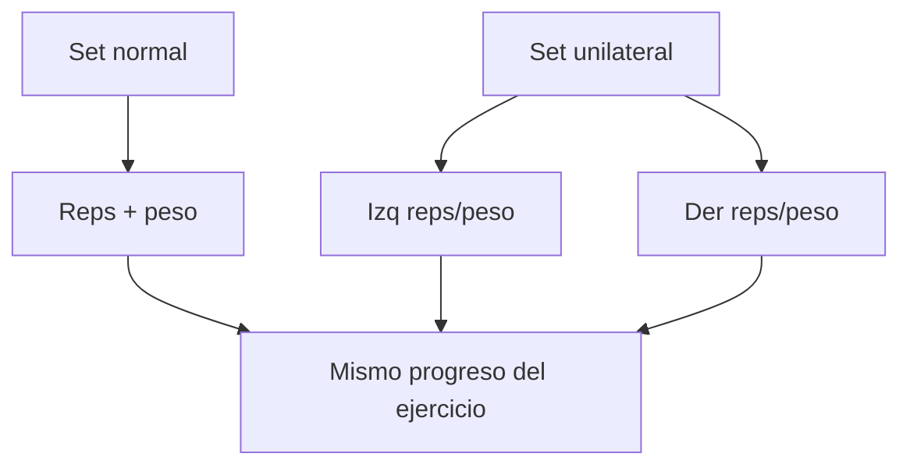
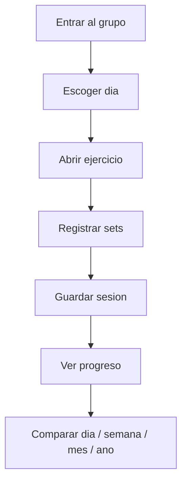

[README.md](https://github.com/user-attachments/files/28066238/README.md)
# Guia rapida: Rutina del Gym

Esta app sirve para compartir rutinas, registrar entrenos y comparar progreso con tu grupo del gym.

## 1. Entrar a la app

Abre el link de la app en Safari o en el navegador:

`https://gusfrava.github.io/star-jazz-gym-Routines/`

Si estas en iPhone, puedes guardarla como app:

1. Abre el link en Safari.
2. Toca el boton de compartir.
3. Toca `Add to Home Screen` / `Agregar a pantalla de inicio`.
4. Abre la app desde el icono nuevo.

## 2. Como entrar a un grupo

La pantalla inicial no muestra la lista de usuarios por privacidad.

Para entrar:

1. Confirma que el grupo arriba sea el correcto.
2. Escribe tu nombre de usuario.
3. Toca `Continuar`.
4. Ingresa tu PIN.

Si es tu primera vez en esa cuenta, la app te pedira crear un PIN.

## 3. Crear cuenta nueva

Usa esta opcion si todavia no tienes usuario dentro del grupo.

1. Toca `Crear cuenta nueva en este grupo`.
2. Escribe tu nombre.
3. Escribe la contrasena de invitacion del grupo.
4. Crea tu PIN personal.

La contrasena de invitacion la comparte la admin del grupo.

## 4. Crear o unirse a un grupo

Usa `Crear grupo nuevo o unirme a otro` si quieres otro grupo separado.

Al crear un grupo:

1. Escribe el nombre del grupo.
2. Crea una contrasena de invitacion.
3. Elige si quieres copiar la rutina actual, usar la rutina base o empezar desde cero.
4. La persona que crea el grupo queda como admin.

Al unirte a un grupo:

1. Escribe el codigo del grupo.
2. Escribe la contrasena de invitacion.
3. Crea o entra con tu usuario dentro de ese grupo.

## 5. Registrar una sesion

1. Entra a un dia de rutina.
2. Abre el ejercicio.
3. Ingresa reps y peso por set.
4. Agrega notas si quieres.
5. Toca `Guardar sesion`.

Atajos utiles:

- `Copiar set 1`: copia el primer set a los campos vacios.
- `Agregar set`: crea un nuevo set copiando el set anterior.
- Si ya habias entrenado ese ejercicio antes, la app muestra valores anteriores como ayuda.

## 6. Sets normales y unilaterales

Puedes mezclar sets normales y unilaterales dentro del mismo ejercicio.

Para un set unilateral:

1. Marca `Uni` en ese set.
2. Llena `Izq reps`, `Izq lb`, `Der reps`, `Der lb`.

El toggle `Unilateral` de arriba es solo un atajo para convertir todos los sets. Cada set tambien tiene su propio `Uni`.

## 7. Ver progreso

Toca `Ver progreso`.

Tabs disponibles:

- `Dia`: resumen de una fecha especifica.
- `Semana`: comparacion semanal.
- `Mes`: comparacion mensual.
- `Ano`: comparacion anual.

En `Dia` puedes ver:

- Sesiones.
- Sets.
- Volumen.
- Peso maximo.
- Notas.
- Entrenos por usuario y ejercicio.

## 8. Editar o borrar sesiones

Puedes editar o borrar tus propias sesiones desde:

- Historial reciente del ejercicio.
- Progreso diario.

Solo puedes editar o borrar tus propios registros.

## 9. Editar rutinas

Dentro de un dia puedes tocar `Editar rutina`.

Puedes:

- Cambiar el nombre del dia.
- Cambiar el enfoque.
- Agregar ejercicios.
- Editar ejercicios.
- Reordenar ejercicios.
- Borrar ejercicios.
- Elegir musculos principales/secundarios.
- Agregar alternativas.
- Cambiar la busqueda de video.

Rutinas disponibles:

- `Compartida`: la rutina del grupo.
- `Personal`: tu propia rutina.

Al crear una rutina personal, puedes copiar la compartida o empezar desde cero.

## 10. Admin del grupo

La admin puede:

- Cambiar la contrasena de invitacion.
- Copiar el codigo del grupo.
- Copiar la contrasena de invitacion.
- Eliminar usuarios.
- Eliminar grupos creados, excepto el grupo original protegido.

El grupo original `jazmin-y-buddy-2026` esta protegido para evitar borrarlo por accidente.

## 11. Privacidad

- La pantalla inicial no muestra la lista de usuarios.
- Para entrar, cada persona escribe su nombre y PIN.
- Dentro del grupo, los miembros pueden ver progreso compartido.
- Cada grupo tiene usuarios, rutinas y progreso separados.

## Resumen rapido

